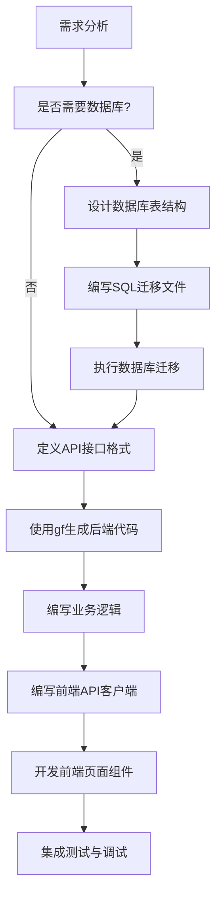

# 模块开发指南

本文档介绍在 JieCool 项目中开发新模块的标准流程，涵盖从数据库设计到前端实现的完整开发步骤。

## 📋 开发流程



## 1. 数据库设计与迁移

### 1.1 判断是否需要数据库

**需要数据库的情况：**
- 需要持久化存储数据
- 数据量较大且需要复杂查询
- 需要事务支持
- 需要数据关联和约束

**不需要数据库的情况：**
- 简单的配置管理（可使用动态配置模块）
- 临时数据处理
- 纯计算型功能

### 1.2 设计数据库表结构

#### 标准字段规范
```sql
-- 主键：使用 UUID
id UUID PRIMARY KEY DEFAULT gen_random_uuid()

-- 时间字段：统一使用带时区的时间戳
created_at TIMESTAMP WITH TIME ZONE DEFAULT NOW()
updated_at TIMESTAMP WITH TIME ZONE DEFAULT NOW()

-- 软删除：统一使用 deleted_at
deleted_at TIMESTAMP WITH TIME ZONE

-- 状态字段：使用枚举类型
status VARCHAR(20) DEFAULT 'active'

-- JSON字段：使用PostgreSQL的JSONB类型
metadata JSONB
```

### 1.3 编写SQL迁移文件

在 `server/db/migrations/` 目录下创建迁移文件：

**命名格式：** `YYYY-MM-DD-HHMMSS_description.sql`

#### 迁移文件模板

```sql
-- Migration: 2024-01-15-143000_create_example_table.sql
-- Description: 创建示例表

BEGIN;

CREATE TABLE example_table (
    id UUID PRIMARY KEY DEFAULT gen_random_uuid(),
    name VARCHAR(100) NOT NULL,
    status VARCHAR(20) DEFAULT 'active',
    metadata JSONB,
    created_at TIMESTAMP WITH TIME ZONE DEFAULT NOW(),
    updated_at TIMESTAMP WITH TIME ZONE DEFAULT NOW(),
    deleted_at TIMESTAMP WITH TIME ZONE
);

-- 创建索引
CREATE INDEX idx_example_table_status ON example_table(status);
CREATE INDEX idx_example_table_created_at ON example_table(created_at);
CREATE INDEX idx_example_table_deleted_at ON example_table(deleted_at);

COMMENT ON TABLE example_table IS '示例表';

COMMIT;
```

### 1.4 执行数据库迁移

```bash
# 使用 psql 执行迁移
psql -h localhost -U admin -d JieCool -f server/db/migrations/2024-01-15-143000_create_example_table.sql

# 验证表创建
psql -h localhost -U admin -d JieCool -c "\d example_table"
```

## 2. 后端API开发

### 2.1 定义API接口格式

在 `server/api/` 目录下创建API定义文件：

#### API定义模板

```go
// File: server/api/v1/example.go
package v1

import (
    "github.com/gogf/gf/v2/frame/g"
)

// ExampleCreateReq 创建请求结构
type ExampleCreateReq struct {
    g.Meta `path:"/example" method:"POST" summary:"创建示例" tags:"示例管理"`
    Name   string `json:"name" v:"required|length:1,100" dc:"名称"`
    Status string `json:"status" v:"in:active,inactive" dc:"状态"`
}

// ExampleCreateRes 创建响应结构
type ExampleCreateRes struct {
    Id string `json:"id" dc:"ID"`
}

// ExampleListReq 列表请求结构
type ExampleListReq struct {
    g.Meta   `path:"/example" method:"GET" summary:"获取示例列表" tags:"示例管理"`
    Page     int    `json:"page" v:"min:1" dc:"页码"`
    PageSize int    `json:"page_size" v:"min:1|max:100" dc:"每页数量"`
    Status   string `json:"status" v:"in:active,inactive" dc:"状态筛选"`
}

// ExampleListRes 列表响应结构
type ExampleListRes struct {
    List     []ExampleItem `json:"list" dc:"数据列表"`
    Total    int           `json:"total" dc:"总数"`
    Page     int           `json:"page" dc:"当前页码"`
    PageSize int           `json:"page_size" dc:"每页数量"`
}

// ExampleItem 数据项
type ExampleItem struct {
    Id        string `json:"id" dc:"ID"`
    Name      string `json:"name" dc:"名称"`
    Status    string `json:"status" dc:"状态"`
    CreatedAt string `json:"created_at" dc:"创建时间"`
    UpdatedAt string `json:"updated_at" dc:"更新时间"`
}

// ExampleGetReq 获取详情请求
type ExampleGetReq struct {
    g.Meta `path:"/example/{id}" method:"GET" summary:"获取示例详情" tags:"示例管理"`
    Id     string `json:"id" v:"required" dc:"ID"`
}

// ExampleGetRes 获取详情响应
type ExampleGetRes struct {
    ExampleItem
}

// ExampleUpdateReq 更新请求
type ExampleUpdateReq struct {
    g.Meta `path:"/example/{id}" method:"PUT" summary:"更新示例" tags:"示例管理"`
    Id     string `json:"id" v:"required" dc:"ID"`
    Name   string `json:"name" v:"required|length:1,100" dc:"名称"`
    Status string `json:"status" v:"in:active,inactive" dc:"状态"`
}

// ExampleUpdateRes 更新响应
type ExampleUpdateRes struct {
    Id string `json:"id" dc:"ID"`
}

// ExampleDeleteReq 删除请求
type ExampleDeleteReq struct {
    g.Meta `path:"/example/{id}" method:"DELETE" summary:"删除示例" tags:"示例管理"`
    Id     string `json:"id" v:"required" dc:"ID"`
}

// ExampleDeleteRes 删除响应
type ExampleDeleteRes struct {
    Success bool `json:"success" dc:"是否成功"`
}
```

### 2.2 使用GoFrame命令生成代码

在 `server` 目录下执行以下命令：

```bash
# 生成控制器
gf gen ctrl

# 生成数据访问层（DAO、DO、Entity）
gf gen dao

# 生成服务接口
gf gen service

# 生成枚举
gf gen enums
```

### 2.3 编写业务逻辑

#### 实现Logic层

GoFrame会生成基础的Logic结构，需要实现具体的业务方法：

```go
// File: server/internal/logic/example/example.go
package example

import (
    "context"
    "github.com/gogf/gf/v2/errors/gcode"
    "github.com/gogf/gf/v2/errors/gerror"

    "JieCool/internal/service"
    "JieCool/internal/dao"
    "JieCool/internal/do"
)

type sExample struct{}

func init() {
    service.RegisterExample(New())
}

func New() service.IExample {
    return &sExample{}
}

// Create 创建数据
func (s *sExample) Create(ctx context.Context, in *do.ExampleCreateInput) (id string, err error) {
    // 数据验证
    if in.Name == "" {
        return "", gerror.NewCode(gcode.CodeValidationFailed, "名称不能为空")
    }

    // 设置默认状态
    if in.Status == "" {
        in.Status = "active"
    }

    // 插入数据
    result, err := dao.Example.Ctx(ctx).Data(in).Insert()
    if err != nil {
        return "", err
    }

    idValue, err := result.LastInsertId()
    if err != nil {
        return "", err
    }

    return idValue, nil
}

// List 获取数据列表
func (s *sExample) List(ctx context.Context, in *do.ExampleListInput) (out *do.ExampleListOutput, err error) {
    out = &do.ExampleListOutput{
        List: make([]*do.ExampleItem, 0),
    }

    // 构建查询
    m := dao.Example.Ctx(ctx)

    // 状态筛选
    if in.Status != "" {
        m = m.Where("status", in.Status)
    }

    // 软删除筛选
    m = m.Where("deleted_at IS NULL")

    // 获取总数
    count, err := m.Count()
    if err != nil {
        return nil, err
    }
    out.Total = count

    // 分页查询
    if in.Page <= 0 {
        in.Page = 1
    }
    if in.PageSize <= 0 {
        in.PageSize = 10
    }

    offset := (in.Page - 1) * in.PageSize
    list, err := m.Page(offset, in.PageSize).OrderDesc("created_at").All()
    if err != nil {
        return nil, err
    }

    // 转换数据
    for _, item := range list {
        out.List = append(out.List, &do.ExampleItem{
            Id:        item.Id,
            Name:      item.Name,
            Status:    item.Status,
            CreatedAt: item.CreatedAt,
            UpdatedAt: item.UpdatedAt,
        })
    }

    out.Page = in.Page
    out.PageSize = in.PageSize

    return out, nil
}

// Get 获取单条数据
func (s *sExample) Get(ctx context.Context, id string) (item *do.ExampleItem, err error) {
    entity, err := dao.Example.Ctx(ctx).
        Where("id", id).
        Where("deleted_at IS NULL").
        One()
    if err != nil {
        return nil, err
    }

    if entity.IsEmpty() {
        return nil, gerror.NewCode(gcode.CodeNotFound, "数据不存在")
    }

    return &do.ExampleItem{
        Id:        entity.Id,
        Name:      entity.Name,
        Status:    entity.Status,
        CreatedAt: entity.CreatedAt,
        UpdatedAt: entity.UpdatedAt,
    }, nil
}

// Update 更新数据
func (s *sExample) Update(ctx context.Context, in *do.ExampleUpdateInput) (id string, err error) {
    // 检查数据是否存在
    entity, err := dao.Example.Ctx(ctx).
        Where("id", in.Id).
        Where("deleted_at IS NULL").
        One()
    if err != nil {
        return "", err
    }

    if entity.IsEmpty() {
        return "", gerror.NewCode(gcode.CodeNotFound, "数据不存在")
    }

    // 更新数据
    _, err = dao.Example.Ctx(ctx).
        Where("id", in.Id).
        Data(in).
        Update()
    if err != nil {
        return "", err
    }

    return in.Id, nil
}

// Delete 删除数据（软删除）
func (s *sExample) Delete(ctx context.Context, id string) (success bool, err error) {
    // 检查数据是否存在
    entity, err := dao.Example.Ctx(ctx).
        Where("id", id).
        Where("deleted_at IS NULL").
        One()
    if err != nil {
        return false, err
    }

    if entity.IsEmpty() {
        return false, gerror.NewCode(gcode.CodeNotFound, "数据不存在")
    }

    // 软删除
    _, err = dao.Example.Ctx(ctx).
        Where("id", id).
        Data("deleted_at", g.Raw("NOW()")).
        Update()
    if err != nil {
        return false, err
    }

    return true, nil
}
```

#### 完善Controller层

GoFrame会自动生成基础的Controller代码，通常只需要简单的数据转换：

```go
// File: server/internal/controller/example/example.go
package example

import (
    "context"

    apiV1 "JieCool/api/v1"
    "JieCool/internal/service"
)

// Create 创建数据
func (c *ControllerV1) Create(ctx context.Context, req *apiV1.ExampleCreateReq) (res *apiV1.ExampleCreateRes, err error) {
    // 调用业务逻辑
    id, err := service.Example().Create(ctx, &do.ExampleCreateInput{
        Name:   req.Name,
        Status: req.Status,
    })
    if err != nil {
        return nil, err
    }

    return &apiV1.ExampleCreateRes{Id: id}, nil
}

// List 获取数据列表
func (c *ControllerV1) List(ctx context.Context, req *apiV1.ExampleListReq) (res *apiV1.ExampleListRes, err error) {
    output, err := service.Example().List(ctx, &do.ExampleListInput{
        Page:     req.Page,
        PageSize: req.PageSize,
        Status:   req.Status,
    })
    if err != nil {
        return nil, err
    }

    // 转换输出格式
    list := make([]apiV1.ExampleItem, 0, len(output.List))
    for _, item := range output.List {
        list = append(list, apiV1.ExampleItem{
            Id:        item.Id,
            Name:      item.Name,
            Status:    item.Status,
            CreatedAt: item.CreatedAt,
            UpdatedAt: item.UpdatedAt,
        })
    }

    return &apiV1.ExampleListRes{
        List:     list,
        Total:    output.Total,
        Page:     output.Page,
        PageSize: output.PageSize,
    }, nil
}

// Get 获取详情
func (c *ControllerV1) Get(ctx context.Context, req *apiV1.ExampleGetReq) (res *apiV1.ExampleGetRes, err error) {
    item, err := service.Example().Get(ctx, req.Id)
    if err != nil {
        return nil, err
    }

    return &apiV1.ExampleGetRes{
        ExampleItem: apiV1.ExampleItem{
            Id:        item.Id,
            Name:      item.Name,
            Status:    item.Status,
            CreatedAt: item.CreatedAt,
            UpdatedAt: item.UpdatedAt,
        },
    }, nil
}

// Update 更新数据
func (c *ControllerV1) Update(ctx context.Context, req *apiV1.ExampleUpdateReq) (res *apiV1.ExampleUpdateRes, err error) {
    id, err := service.Example().Update(ctx, &do.ExampleUpdateInput{
        Id:     req.Id,
        Name:   req.Name,
        Status: req.Status,
    })
    if err != nil {
        return nil, err
    }

    return &apiV1.ExampleUpdateRes{Id: id}, nil
}

// Delete 删除数据
func (c *ControllerV1) Delete(ctx context.Context, req *apiV1.ExampleDeleteReq) (res *apiV1.ExampleDeleteRes, err error) {
    success, err := service.Example().Delete(ctx, req.Id)
    if err != nil {
        return nil, err
    }

    return &apiV1.ExampleDeleteRes{Success: success}, nil
}
```

### 2.4 测试后端接口

#### 启动服务

```bash
cd server
gf run main.go
# 或者
make run
```

#### 测试接口

```bash
# 创建数据
curl -X POST http://localhost:8080/example \
  -H "Content-Type: application/json" \
  -d '{"name": "测试数据", "status": "active"}'

# 获取列表
curl -X GET "http://localhost:8080/example?page=1&page_size=10"

# 获取详情
curl -X GET http://localhost:8080/example/{id}

# 更新数据
curl -X PUT http://localhost:8080/example/{id} \
  -H "Content-Type: application/json" \
  -d '{"name": "更新后的名称", "status": "inactive"}'

# 删除数据
curl -X DELETE http://localhost:8080/example/{id}
```

**Swagger文档：** http://localhost:8080/swagger

## 3. 前端页面开发

### 3.1 编写API客户端

在 `front-web/src/lib/` 目录下创建模块的API客户端：

#### API客户端模板

```typescript
// File: front-web/src/lib/example-api.ts
import { alova } from './alova'

export const exampleApi = {
  create: (data: ExampleCreateReq) => {
    return alova.Post<ExampleCreateRes>('/example', data)
  },

  list: (params: ExampleListReq) => {
    return alova.Get<ExampleListRes>('/example', { params })
  },

  get: (id: string) => {
    return alova.Get<ExampleGetRes>(`/example/${id}`)
  },

  update: (id: string, data: ExampleUpdateReq) => {
    return alova.Put<ExampleUpdateRes>(`/example/${id}`, data)
  },

  delete: (id: string) => {
    return alova.Delete<ExampleDeleteRes>(`/example/${id}`)
  }
}
```

#### 定义TypeScript类型

```typescript
// File: front-web/src/types/example.ts
export interface ExampleCreateReq {
  name: string
  status?: 'active' | 'inactive'
}

export interface ExampleCreateRes {
  id: string
}

export interface ExampleListReq {
  page?: number
  page_size?: number
  status?: 'active' | 'inactive'
}

export interface ExampleItem {
  id: string
  name: string
  status: 'active' | 'inactive'
  created_at: string
  updated_at: string
}

export interface ExampleListRes {
  list: ExampleItem[]
  total: number
  page: number
  page_size: number
}

export interface ExampleGetReq {
  id: string
}

export interface ExampleGetRes extends ExampleItem {}

export interface ExampleUpdateReq {
  id: string
  name: string
  status?: 'active' | 'inactive'
}

export interface ExampleUpdateRes {
  id: string
}

export interface ExampleDeleteReq {
  id: string
}

export interface ExampleDeleteRes {
  success: boolean
}
```

### 3.2 开发前端页面组件

#### 页面结构

在 `front-web/src/app/example/` 目录下创建页面：

```typescript
// File: front-web/src/app/example/page.tsx
'use client'

import React, { useState, useEffect } from 'react'
import { Card, Table, Button, Space, Tag, message, Modal } from '@arco-design/web-react'
import { IconPlus, IconEdit, IconDelete } from '@arco-design/web-react/icon'
import { exampleApi } from '@/lib/example-api'
import type { ExampleItem } from '@/types/example'
import ExampleForm from '@/components/features/example-form'
import styles from './page.module.css'

export default function ExamplePage() {
  const [data, setData] = useState<ExampleItem[]>([])
  const [loading, setLoading] = useState(false)
  const [total, setTotal] = useState(0)
  const [page, setPage] = useState(1)
  const [pageSize, setPageSize] = useState(10)
  const [formVisible, setFormVisible] = useState(false)
  const [editingItem, setEditingItem] = useState<ExampleItem | null>(null)

  // 加载数据
  const loadData = async () => {
    setLoading(true)
    try {
      const response = await exampleApi.list({
        page,
        page_size: pageSize
      })
      setData(response.data.list)
      setTotal(response.data.total)
    } catch (error) {
      message.error('加载数据失败')
      console.error(error)
    } finally {
      setLoading(false)
    }
  }

  useEffect(() => {
    loadData()
  }, [page, pageSize])

  // 处理删除
  const handleDelete = (item: ExampleItem) => {
    Modal.confirm({
      title: '确认删除',
      content: `确定要删除"${item.name}"吗？`,
      onOk: async () => {
        try {
          await exampleApi.delete(item.id)
          message.success('删除成功')
          loadData()
        } catch (error) {
          message.error('删除失败')
        }
      }
    })
  }

  // 处理编辑
  const handleEdit = (item: ExampleItem) => {
    setEditingItem(item)
    setFormVisible(true)
  }

  // 处理新增
  const handleAdd = () => {
    setEditingItem(null)
    setFormVisible(true)
  }

  // 表单提交成功
  const handleFormSuccess = () => {
    setFormVisible(false)
    setEditingItem(null)
    loadData()
  }

  // 表格列配置
  const columns = [
    {
      title: '名称',
      dataIndex: 'name',
      width: 200
    },
    {
      title: '状态',
      dataIndex: 'status',
      width: 100,
      render: (status: string) => {
        const statusMap = {
          active: { color: 'green', text: '激活' },
          inactive: { color: 'gray', text: '停用' }
        }
        const config = statusMap[status as keyof typeof statusMap]
        return <Tag color={config.color}>{config.text}</Tag>
      }
    },
    {
      title: '创建时间',
      dataIndex: 'created_at',
      width: 180,
      render: (time: string) => new Date(time).toLocaleString()
    },
    {
      title: '操作',
      width: 150,
      render: (_: any, record: ExampleItem) => (
        <Space>
          <Button
            type="text"
            size="small"
            icon={<IconEdit />}
            onClick={() => handleEdit(record)}
          >
            编辑
          </Button>
          <Button
            type="text"
            size="small"
            status="danger"
            icon={<IconDelete />}
            onClick={() => handleDelete(record)}
          >
            删除
          </Button>
        </Space>
      )
    }
  ]

  return (
    <div className={styles.container}>
      <Card className={styles.header}>
        <div className={styles.headerContent}>
          <h2>示例管理</h2>
          <Button
            type="primary"
            icon={<IconPlus />}
            onClick={handleAdd}
          >
            新建
          </Button>
        </div>
      </Card>

      <Card className={styles.tableCard}>
        <Table
          columns={columns}
          data={data}
          loading={loading}
          pagination={{
            current: page,
            pageSize,
            total,
            showTotal: true,
            showJumper: true,
            onChange: (newPage, newPageSize) => {
              setPage(newPage)
              if (newPageSize !== pageSize) {
                setPageSize(newPageSize)
              }
            }
          }}
        />
      </Card>

      <Modal
        title={editingItem ? '编辑' : '新建'}
        visible={formVisible}
        onCancel={() => setFormVisible(false)}
        footer={null}
        width={600}
      >
        <ExampleForm
          item={editingItem}
          onSuccess={handleFormSuccess}
          onCancel={() => setFormVisible(false)}
        />
      </Modal>
    </div>
  )
}
```

#### 表单组件

```typescript
// File: front-web/src/components/features/example-form.tsx
'use client'

import React, { useState } from 'react'
import { Form, Input, Button, Select, message } from '@arco-design/web-react'
import { exampleApi } from '@/lib/example-api'
import type { ExampleItem } from '@/types/example'

interface ExampleFormProps {
  item?: ExampleItem | null
  onSuccess: () => void
  onCancel: () => void
}

export default function ExampleForm({ item, onSuccess, onCancel }: ExampleFormProps) {
  const [form] = Form.useForm()
  const [loading, setLoading] = useState(false)

  React.useEffect(() => {
    if (item) {
      form.setFieldsValue({
        name: item.name,
        status: item.status
      })
    } else {
      form.resetFields()
    }
  }, [item, form])

  const handleSubmit = async (values: any) => {
    setLoading(true)
    try {
      if (item) {
        await exampleApi.update(item.id, values)
        message.success('更新成功')
      } else {
        await exampleApi.create(values)
        message.success('创建成功')
      }
      onSuccess()
    } catch (error) {
      message.error(item ? '更新失败' : '创建失败')
    } finally {
      setLoading(false)
    }
  }

  return (
    <Form
      form={form}
      layout="vertical"
      onSubmit={handleSubmit}
      autoComplete="off"
    >
      <Form.Item
        label="名称"
        field="name"
        rules={[
          { required: true, message: '请输入名称' },
          { maxLength: 100, message: '名称不能超过100个字符' }
        ]}
      >
        <Input placeholder="请输入名称" />
      </Form.Item>

      <Form.Item
        label="状态"
        field="status"
        initialValue="active"
      >
        <Select>
          <Select.Option value="active">激活</Select.Option>
          <Select.Option value="inactive">停用</Select.Option>
        </Select>
      </Form.Item>

      <Form.Item>
        <Space>
          <Button type="primary" htmlType="submit" loading={loading}>
            {item ? '更新' : '创建'}
          </Button>
          <Button onClick={onCancel}>
            取消
          </Button>
        </Space>
      </Form.Item>
    </Form>
  )
}
```

#### 页面样式

```css
/* File: front-web/src/app/example/page.module.css */
.container {
  padding: 20px;
  background: #f5f5f5;
  min-height: 100vh;
}

.header {
  margin-bottom: 20px;
}

.headerContent {
  display: flex;
  justify-content: space-between;
  align-items: center;
}

.headerContent h2 {
  margin: 0;
  font-size: 20px;
  font-weight: 600;
}

.tableCard {
  box-shadow: 0 2px 8px rgba(0, 0, 0, 0.1);
}
```

### 3.3 路由登记

在 `front-web/src/app/test/page.tsx` 中添加新页面路由：

```typescript
// 找到 routes 数组，添加新路由
const routes = [
  // ... 其他路由
  {
    name: '示例管理',
    path: '/example',
    description: '示例管理模块'
  }
]
```

## 4. 调试与测试

### 4.1 数据库调试

使用 PostgreSQL MCP 进行数据库调试：

```bash
# 连接数据库
mcp postgres connect-db --host localhost --port 5432 --user admin --password 123456 --database JieCool
```

#### 常用查询命令

```sql
-- 查看表结构
\d example_table

-- 查看数据
SELECT * FROM example_table ORDER BY created_at DESC;

-- 查看软删除的数据
SELECT * FROM example_table WHERE deleted_at IS NOT NULL;

-- 统计数据
SELECT status, COUNT(*) as count FROM example_table WHERE deleted_at IS NULL GROUP BY status;
```

### 4.2 前端调试

使用 Chrome DevTools MCP 进行前端调试：

```bash
# 启动前端
cd front-web && npm run dev

# 调试页面
mcp chrome-devtools navigate --url http://localhost:3000/example
```

#### 调试步骤

1. **页面渲染检查**：验证页面正常加载
2. **API请求测试**：检查网络请求和响应
3. **交互功能验证**：测试CRUD操作
4. **样式响应测试**：检查不同屏幕尺寸

#### 常用调试命令

```bash
# 获取页面快照
mcp chrome-devtools take-snapshot

# 点击元素
mcp chrome-devtools click --uid "element-uid"

# 填写表单
mcp chrome-devtools fill --uid "input-uid" --value "test value"

# 等待元素
mcp chrome-devtools wait-for --text "加载完成"
```

## 5. 开发工具与命令

### 5.1 常用开发命令

#### 后端开发

```bash
# 启动开发服务器
cd server && gf run main.go

# 使用 Makefile
make run      # 启动服务
make build    # 构建项目
make ctrl     # 生成控制器
make dao      # 生成DAO
make service  # 生成服务接口
```

#### 前端开发

```bash
# 启动开发服务器
cd front-web && npm run dev

# 构建生产版本
npm run build

# 代码检查
npm run lint

# E2E测试
npx playwright test
```

### 5.2 GoFrame 代码生成

```bash
# 生成控制器
gf gen ctrl

# 生成数据访问层
gf gen dao

# 生成服务接口
gf gen service

# 生成枚举
gf gen enums
```

## 6. 常见问题

### Q1: 数据库迁移失败？

**解决方案：**
1. 检查SQL语法错误
2. 确认数据库连接正常
3. 检查外键约束冲突
4. 使用事务确保原子性
5. 准备回滚脚本

### Q2: GoFrame代码生成失败？

**解决方案：**
1. 检查API定义文件语法
2. 确认CLI版本匹配
3. 检查数据库连接
4. 验证表结构字段匹配
5. 查看生成日志定位错误

### Q3: 前端API请求失败？

**解决方案：**
1. 检查后端服务启动状态
2. 验证API路径和参数
3. 检查网络连接和CORS
4. 查看浏览器控制台错误
5. 使用开发者工具查看请求详情

### Q4: 软删除处理？

**最佳实践：**
1. 查询时添加 `deleted_at IS NULL` 条件
2. 删除使用 `UPDATE SET deleted_at = NOW()`
3. 恢复设置 `deleted_at = NULL`
4. 提供管理员查看删除数据功能

### Q5: 大数据量查询优化？

**优化策略：**
1. 添加合适的数据库索引
2. 使用分页查询
3. 实现缓存机制
4. 考虑数据库视图
5. 监控和优化慢查询

## 7. 项目规范

### 7.1 命名规范

- **数据库表名**：英文下划线命名（如：`example_table`）
- **API路径**：英文小写+连字符（如：`/example`）
- **组件名**：英文大写驼峰（如：`ExampleForm`）
- **文件名**：英文小写+连字符（如：`example-api.ts`）

### 7.2 代码规范

- 所有代码必须包含中文注释
- API接口必须使用GoFrame代码生成
- 前端页面必须进行路由登记
- 文档变更需要及时更新

### 7.3 目录结构

```
server/
├── api/                    # API定义
├── internal/
│   ├── controller/         # 控制器
│   ├── service/           # 服务层
│   ├── logic/             # 业务逻辑
│   ├── dao/               # 数据访问
│   └── model/             # 数据模型
└── db/migrations/         # 数据库迁移

front-web/
├── src/
│   ├── app/               # 页面
│   ├── components/        # 组件
│   ├── lib/               # API客户端
│   └── types/             # TypeScript类型
```

---

通过遵循本开发指南，可以高效地在 JieCool 项目中开发新功能模块。